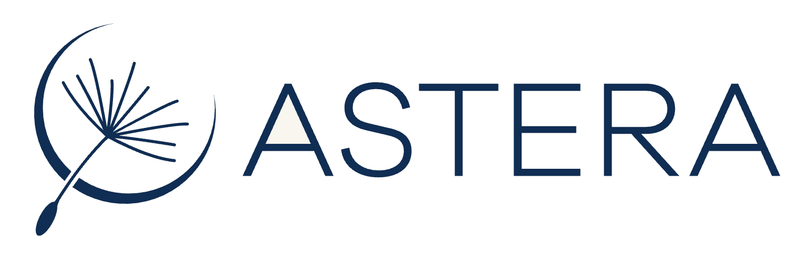
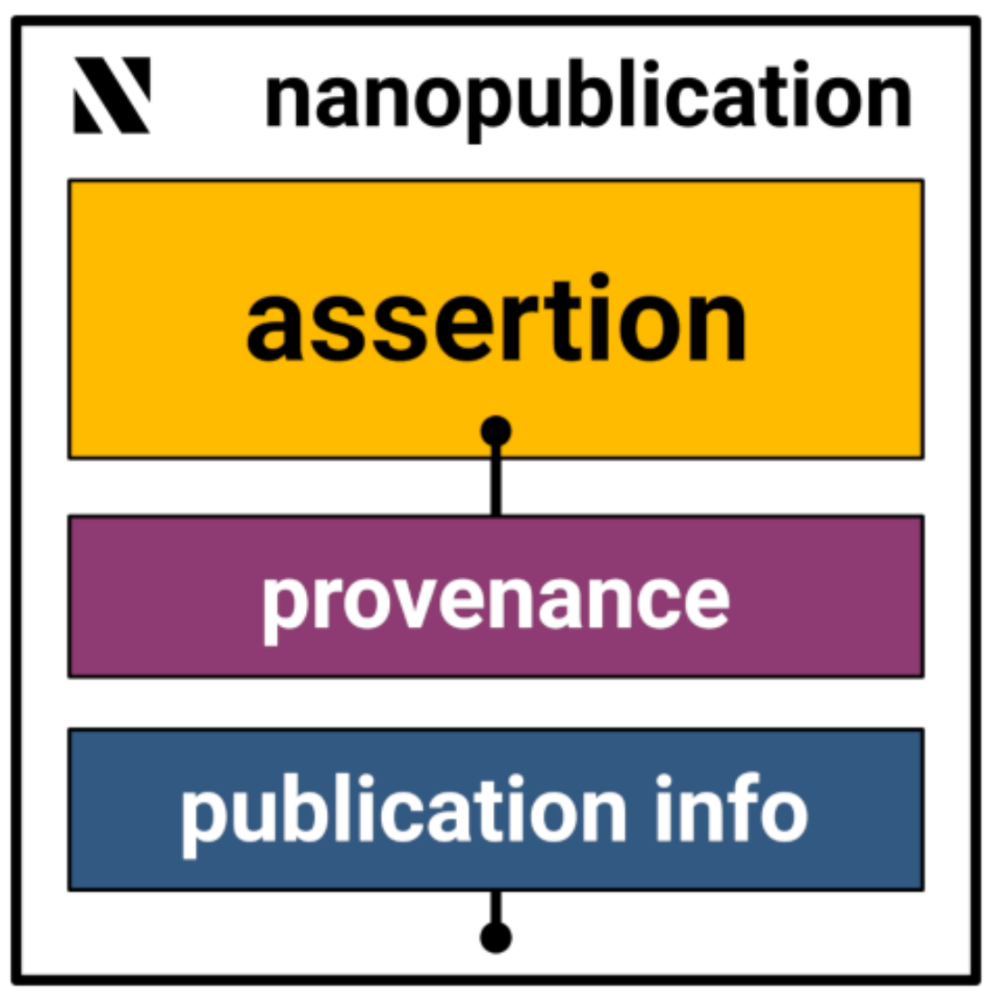
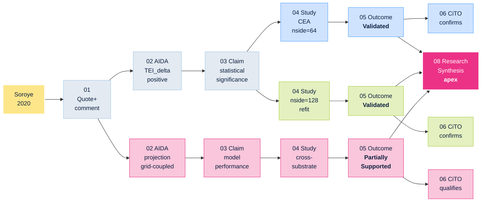
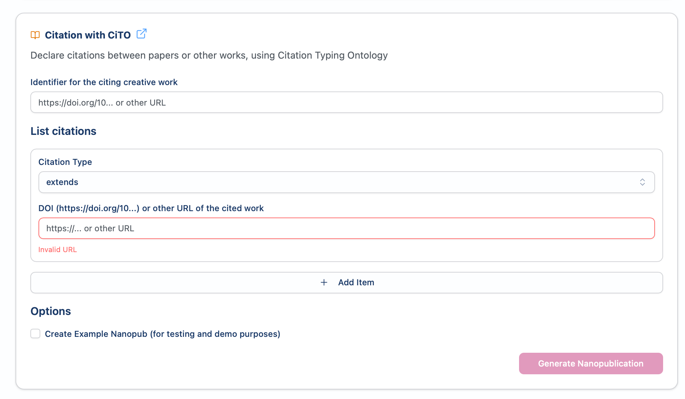
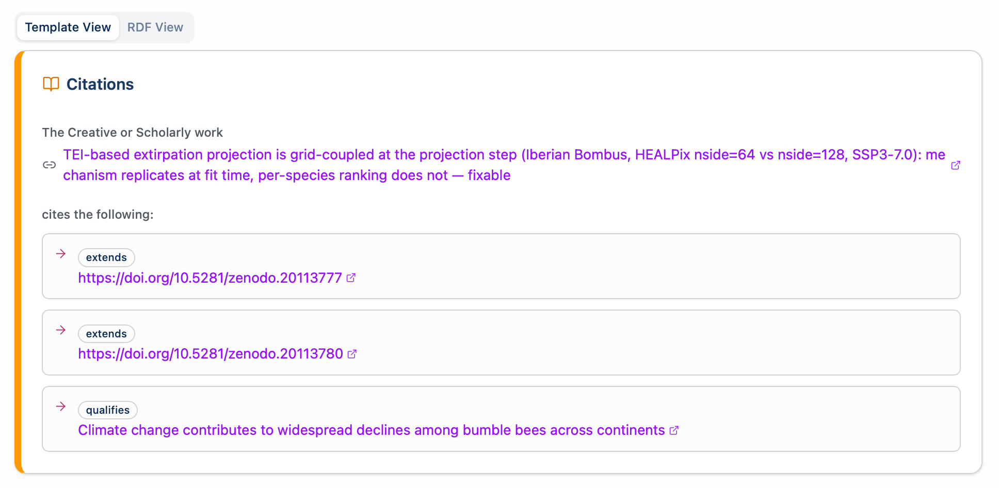

# Stackable <span class="sl-secondary">Citation</span> Knowledge

<div class="text-lg opacity-90 pt-2">

Building on Nanopublications for Climate and Biodiversity Research

</div>

<div class="pt-8 text-sm space-y-3">

<div>

**Anne Fouilloux** · LifeWatch ERIC · [0000-0002-1784-2920](https://orcid.org/0000-0002-1784-2920)

</div>

<div>

**Jean Iaquinta** · Vitenhub AS · [0000-0002-8763-1643](https://orcid.org/0000-0002-8763-1643)

</div>

</div>

<div class="pt-10 text-xs sl-blue">
CiteX 2026 · Workshop on Citation Extraction and Parsing · Frankfurt · 28 May 2026
</div>

<div class="pt-8 flex items-center justify-center gap-3">

<div class="text-xs opacity-70 tracking-wider uppercase">Funded by</div>



</div>

<div class="pt-2 text-xs text-center opacity-80">

A collaboration between **VitenHub AS** · **Knowledge Pixels** · **Prophet Town**

</div>

<!--
Opening line (≈20 s):
"Thanks Tamara, and thanks to the programme committee. I'm Anne Fouilloux,
joining remotely from LifeWatch ERIC in Spain. This is joint work with
Jean Iaquinta at Vitenhub. We want to argue that citation extraction is
only half of what open citations need — the other half is making the
extracted thing addressable and stackable. We'll show what that means
with a worked example you can click into during this talk."
-->

---

<div class="text-2xl font-semibold pb-1">Citation data has two jobs</div>
<div class="text-xs opacity-70 pb-3">Credit prior work · works today &nbsp;·&nbsp; Enable building upon · open problem</div>

<div class="grid grid-cols-2 gap-5 text-sm">

<div class="border-l-4 border-sl-primary pl-4">

### A reference list entry today

```
Soroye, P., Newbold, T., & Kerr, J. (2020).
Climate change contributes to widespread
declines among bumble bees across continents.
Science, 367, 685.
doi:10.1126/science.aax8591
```

→ [doi.org/10.1126/science.aax8591](https://doi.org/10.1126/science.aax8591)

The reader still has to read the body text to learn *which* of Soroye's claims this paper builds on, whether that claim was confirmed, disputed, or qualified, and under which conditions.

</div>

<div class="border-l-4 border-sl-success pl-4">

### A stackable reference list entry

```
Soroye et al. 2020
  cito:qualifies → CiTO nanopub RAumfa30…
  apex Research Synthesis → RA5TJVZ0…
  Bombus · Iberia · SSP3-7.0 · 18 nanopubs
```

→ CiTO: [RAumfa30…](https://w3id.org/sciencelive/np/RAumfa30WMPlQksc1f6XdslPtXS2z4-_3DCZC3ln57PKc) · Synthesis: [RA5TJVZ0…](https://w3id.org/sciencelive/np/RA5TJVZ0_5Knzxd4OtOoZgO6ZspWHwVCSLWNNd7V9H6QQ)

The reader clicks the URI: typed qualification, the sub-claim qualified, the study that produced the qualification, the outcome.

</div>

</div>

<div class="text-sm opacity-80 text-center pt-3">

OpenCitations + WikiCite already build the **left**. We add a **citable target** on the right.

</div>

<!--
Beat (~2 min):
- Lead with "two jobs, one works, one doesn't" — and SHOW it
- Point at the left: "you've all seen this. A 4-line reference list entry. Excellent for credit, opaque for building-upon."
- Point at the right: "this is the same citation in our stackable form. The URI in the middle is a click-resolvable signed nanopub. The reader doesn't have to read the body to learn what was qualified — they click."
- Punchline: "OpenCitations and WikiCite already build the left-hand side beautifully. What's missing is a citable target on the right — and that's what the rest of this talk is about."
-->

---

# Stackable architecture

<div class="grid grid-cols-2 gap-6 pt-2">

<div class="text-center">



<div class="text-xs pt-2 opacity-85">

**Assertion** · RDF triples + Wikidata Q-IDs
**Provenance** · PROV-O derivation chain
**Publication info** · ORCID · timestamp · CC-BY 4.0

</div>

<div class="text-xs pt-2 opacity-70">

<small>Groth et al. 2010 · Trusty URI = cryptographic hash · Kuhn et al. 2021</small>

</div>

<div class="text-xs pt-2 sl-blue">

Decentralised network · **no single point of failure** · nanopubs survive any one platform shutting down

</div>

</div>

<div class="pt-4">

### Why stackable

- Each step in a citation chain is **its own nanopub**
- Each nanopub has **its own URI**
- A future paper can cite **one specific claim**, not just the paper
- CiTO types make the *intent* machine-readable:

`extends · usesMethodIn · disputes · citesAsEvidence · qualifies`

</div>

</div>

<!--
Beat (~3 min):
- Point at the diagram (left). "Three named graphs in one nanopub. Top: the assertion — the actual claim. Middle: provenance — how the claim was derived. Bottom: publication info — who, when, under what licence."
- "The URI itself contains a hash of the assertion. You cannot quietly rewrite a published nanopub. Cryptographic immutability is built into the identifier."
- Right column: "And because each nanopub has its own URI, you can build chains where each step cites a specific upstream nanopub. The next slide shows what that looks like in practice."
- Land the "stackable" word here, not earlier.
-->

---

<div class="text-2xl font-semibold pb-1">Stackable in practice — a FORRT replication chain</div>
<div class="text-xs opacity-70 pb-2">Soroye et al. 2020 (Science) · Iberian *Bombus* under SSP3-7.0 · apex [<span class="font-mono">RA5TJVZ0…</span>](https://w3id.org/sciencelive/np/RA5TJVZ0_5Knzxd4OtOoZgO6ZspWHwVCSLWNNd7V9H6QQ) wraps the whole chain into one citable URI</div>

<div class="w-full">



</div>

<div class="text-xs opacity-75 text-center pt-2">

All 16 nodes are addressable nanopubs · see slide 12 for the full clickable URI list.

</div>

<!--
Beat (~2 min) — "show, don't tell" of stackable:
- Don't read the diagram. Point: "every node is its own nanopub with its own URI"
- Say: "Soroye 2020 on the left — what we replicated. Three coloured branches: two
  flavours of the thermal-niche claim plus a cross-substrate replication. Each ends in a CiTO
  citation back to the original paper — two 'confirms', one 'qualifies'."
- Punchline (point at magenta apex on the right): "Synthesis on the right is one URI. Cite that
  one URI and you've cited the full constellation. That's what stackable means."
- Every box is a clickable hyperlink to the published nanopub on Science Live. Useful in Q&A:
  if anyone asks "what does an actual Outcome nanopub look like?" — click `05 Outcome Validated`.
- Research Software nanopubs (used for tooling reuse) are omitted from the diagram for clarity —
  mention only if asked. They cite the Claim one-way and live off-chain.
- This slide is the *concrete* version of slide 3. Slide 6 is how you build one.
-->

---

<div class="text-2xl font-semibold pb-1">From form to network</div>
<div class="text-xs opacity-70 pb-3">One CiTO citation, end-to-end · Science Live authoring UI on the left · the published nanopub on the right (cito:qualifies Soroye 2020 — <span class="font-mono">RAumfa30…</span>)</div>

<div class="grid grid-cols-2 gap-5 items-center">

<div class="text-center">



<div class="text-xs opacity-80 pt-2">

Author picks the **citation type** (`extends · usesMethodIn · disputes · qualifies …`) and the cited DOI · clicks *Generate Nanopublication*

</div>

</div>

<div class="text-center">



<div class="text-xs opacity-80 pt-2">

The resulting nanopub on the network · each typed citation is independently click-resolvable

</div>

</div>

</div>

<div class="text-sm opacity-90 text-center pt-3 italic">

→ &nbsp;Two clicks from "I want to cite this paper" to a signed, addressable, machine-readable citation on the open network.

</div>

<!--
Beat (~1.5 min) — visual bridge between the chain (slide 4) and the production paths (slide 6):
- Don't read the form. Point at it: "this is what an author fills in. Citation type, cited DOI, generate."
- Point at the right: "this is what comes out — the same RAumfa30 nanopub you saw mentioned on slides 2, 4, and 10. Three typed citations visible at a glance: extends the nside=64 sibling, extends the nside=128 sibling, qualifies Soroye 2020."
- Punchline: "two clicks. Author chooses the destination; the platform handles the signing, the network publishing, and the resolver."
- This is the slide that proves "Author at write time" is actually low-friction. It's not vapourware.
-->

---

<div class="text-2xl font-semibold pb-1">Two production paths to a signed nanopub</div>
<div class="text-sm opacity-80 pb-3 italic">

Self-driving cars *will* drive themselves — but humans still choose the destination. Same for LLM citation extraction: the model does the work · the author chooses the *intent*.

</div>

<div class="grid grid-cols-2 gap-5 text-sm">

<div class="border-l-4 border-sl-accent pl-4">

### Extract — from existing papers

**Tool stack:** GROBID / Anystyle → LLM intent classifier

The LLM reads the citation *context* and classifies the intent — what CEC, GRAPHIA, OFFZIB are working on.

```
PDF → references + context
    → LLM → CiTO predicate
    → AIDA + Wikidata
    → signed nanopub
```

**Limit:** intent recovery has a ceiling. The author is the only one who definitively knows *why* they cited.

</div>

<div class="border-l-4 border-sl-success pl-4">

### Author — from Zotero

**Workflow:** open paper · highlight quote · add comment · pick CiTO type · plugin signs + publishes.

**Worked example** (Soroye 2020 → Bombus):

- **Quote** *(verbatim from Soroye 2020)*: "…"
- **Comment**: "Iberian *Bombus* — direction held, rare-specialist ranking reshuffled at nside=64→128."
- **CiTO**: `cito:qualifies`
- **Result**: Quote-with-comment [<span class="font-mono">RAErLL…</span>](https://w3id.org/sciencelive/np/RAErLL_QSe3e0pKBxHkUHH5v49F66fFVuS2OmYMJz02OY)

Intent declared at *write time* — no ceiling.

</div>

</div>

<div class="text-xs opacity-75 text-center pt-3">

LLM extraction → **FORRT chain** via the replication template. Zotero → **Quote-with-comment** as chain step 01.

</div>

<!--
Beat (~3 min):
- OPEN with the analogy (it's printed but say it out loud, slowly): "Self-driving cars will drive themselves — but humans still choose the destination. LLM extraction is the same. The model can do the driving — the author still chooses the citation intent."
- LEFT (Extract): "this is where most of you live. GROBID / CEC / GRAPHIA — extract intent retroactively. We're additive, not competing — the extracted intent becomes a signed nanopub on the network."
- Limit: "but extraction has an accuracy ceiling because intent is partially implicit in prose"
- RIGHT (Author): point at the worked example. "The Zotero plugin lets the author declare intent at write time, from the source that knows best. Highlight the quote. Comment. Pick the CiTO type. Sign and publish. That's a Quote-with-comment nanopub — the first step of every FORRT chain you saw on slide 4."
- Closing technical bridge: "LLM extraction lands you in a FORRT chain via the replication template. Zotero authoring lands you at chain step 01."
- BEFORE DELIVERY: replace the "…" in the Quote field with the actual verbatim sentence from the Soroye 2020 paper used in the RAErLL… nanopub.
-->

---

<div class="text-2xl font-semibold pb-1">Three worked domains</div>
<div class="text-xs opacity-70 pb-3">One named citable URI per column — these resolve today on the open network</div>

<div class="grid grid-cols-3 gap-4 text-sm">

<div class="border-l-4 border-sl-success pl-3">

### Biodiversity
**LifeWatch ERIC**

Iberian *Bombus* replication of Soroye 2020 — three branches under SSP3-7.0.

**Apex Synthesis**
[<span class="font-mono text-xs">RA5TJVZ0…</span>](https://w3id.org/sciencelive/np/RA5TJVZ0_5Knzxd4OtOoZgO6ZspWHwVCSLWNNd7V9H6QQ)

*Breadth*: a PRISMA-compliant systematic review on quantum-biodiversity adds **238 more nanopubs** with full CiTO typing.

</div>

<div class="border-l-4 border-sl-accent pl-3">

### Climate change
**EarthCARE → DGGS pipeline**

Full software stack converting EarthCARE EO data to HEALPix-geo, published as a FORRT chain + Research Software nanopub.

**CiTO citation**
[<span class="font-mono text-xs">RANOHJytFV4…</span>](https://w3id.org/sciencelive/np/RANOHJytFV4_sXH6qIV41aBpkoBXCZz7wjTWJBvT9QudI)

</div>

<div class="border-l-4 border-sl-secondary pl-3">

### Cross-discipline
**FIESTA — plankton classification**

Scattering transforms from **astrophysics** (Delouis et al. 2022) applied to **plankton imagery** (Decrop et al. 2025) — +8 pp rare-class recall.

**One CiTO nanopub, three predicates**: `extends` · `usesMethodIn` · `citesAsDataSource`

[<span class="font-mono text-xs">RA8BSfq4Cbs3…</span>](https://w3id.org/sciencelive/np/RA8BSfq4Cbs3A4chU6fvafk0px-yDZwsYKFIO9cnzkyx4)

</div>

</div>

<div class="text-xs opacity-80 text-center pt-3">

<span class="sl-secondary font-bold">On the network today</span>: 18-nanopub Bombus chain · 238-nanopub PRISMA review · EarthCARE → DGGS chain · FIESTA cross-disciplinary chain.

</div>

<!--
Beat (~3 min):
- Point at the left first: "the chain you saw on slide 4 — its apex is RA5TJVZ0. Click that URI and you reach all 18 nanopubs."
- "The quantum-biodiversity PRISMA review contributes 238 more nanopubs on the same network — different domain question, same architecture."
- Middle (Climate change → EarthCARE → DGGS): "we built the full software pipeline to convert EarthCARE EO data to HEALPix-geo. The CiTO chain ties the new data to the upstream literature. Click the URI to see the chain."
- Right (Cross-discipline → FIESTA plankton): "scattering transforms — a method from astrophysics — applied to plankton classification. Same nanopub carries three CiTO predicates simultaneously: extends the original plankton paper, uses the astrophysics method, cites our reproduction as a data source. This is what cross-disciplinary citation looks like when it's machine-readable."
- Three URIs all resolve today; nothing is forthcoming.
-->

---
layout: center
class: text-center
---

# This paper *is* 21 nanopubs

<div class="pt-6 text-2xl opacity-80">

7 AIDA cited claims · 6 CiTO citation relations · 8 Wikidata concept definitions

</div>

<div class="pt-12 text-lg opacity-60">

The extended abstract is its own worked example.

<br/>

Every citation has an inline CiTO type and a click-resolvable URI.

</div>

<div class="pt-12 text-base">

**→ Switching to demo**

</div>

<!--
Beat (~30 s — this slide is the demo cue):
- Pause. Let the slide sit.
- Say: "I want to show you what this looks like rather than describe it. The extended abstract for this talk, that some of you may have read on the Zenodo community page, is itself 21 nanopubs. Watch."
- Switch to demo recording.
-->

---
layout: center
class: text-center
---

# [ Demo ]

<div class="pt-6 opacity-60">~4–5 min · pre-recorded</div>

<div class="pt-12 text-sm opacity-50">
If the recording fails, fallback: open <code>platform.sciencelive4all.org</code> in browser and walk through one nanopub URI manually.
</div>

<!--
This slide exists only as a holding image while the demo recording plays.
Demo content (per the demo-script.md in this repo):
1. Open the published extended abstract on the Zenodo community
2. Click the inline CiTO link for Groth 2010 [citesAsAuthority]
3. Resolve the nanopub on platform.sciencelive4all.org/np/
4. Show the three-graph TriG structure
5. Click through to the Wikidata Q-ID for "nanopublication"
6. Back to abstract, click Kuhn 2021 [usesMethodIn] — different CiTO type
7. Close: "each citation in the paper is a click-resolvable, signed, addressable unit"
-->

---

<div class="text-2xl font-semibold pb-1">Atomicity enables claim-level verification</div>
<div class="text-sm opacity-85 pb-3 italic">

Hallucinated and miscited references are increasingly slipping through peer review — even in high-ranked journals. Reviewers are unpaid researchers, and many now use LLMs themselves. *"Verify the whole paper"* is intractable. **Verify one claim at a time.**

</div>

<div class="grid grid-cols-3 gap-3 text-sm">

<div class="border border-sl-warning rounded p-3">

### LLM-extracted

- Pipeline output from intent classifier
- Open to **intent-hallucination**
- *Example*: an LLM-classified citation in the 238-nanopub PRISMA review, pre author-validation
- ⚠ Open: author-side validation UX

</div>

<div class="border border-sl-accent rounded p-3">

### Author-validated

- Author confirms AIDA + CiTO at write time
- Signed nanopub binds intent to assertion
- *Example*: Quote-with-comment [<span class="font-mono">RAErLL…</span>](https://w3id.org/sciencelive/np/RAErLL_QSe3e0pKBxHkUHH5v49F66fFVuS2OmYMJz02OY) *(slide 6)*
- Zotero plugin = lowest-friction path

</div>

<div class="border border-sl-success rounded p-3">

### FORRT-replicated

- Replication links its Outcome to the Claim
- Trust becomes a **citation signal**
- *Example*: nside=128 Outcome [<span class="font-mono">RAa4QR41…</span>](https://w3id.org/sciencelive/np/RAa4QR41Hot9zxujcrCyTo82Ij7oaw_6z8zk8NxDqoJFM) *(slide 4)*
- ⚠ Open: verified/contested markers in-network

</div>

</div>

<div class="text-sm opacity-90 text-center pt-3 italic">

Do one thing and do it well — applied to citations. Atomicity makes verification **tractable**, not zero.

</div>

<!--
Beat (~3 min):
- The trust gradient is the honest answer to "how do you know an LLM didn't hallucinate this?"
- The FORRT layer is the differentiating move — we publish the verification chain alongside the original claim
- Acknowledge limitations openly — this audience will trust the work more for it
-->

---
class: text-center
---

<div class="text-2xl font-semibold pb-1">Try it · Cite it · Extend it</div>

<div class="text-xs text-center pb-2 italic opacity-90">

**Open source · open governance.** Your nanopubs live in the decentralised network — not on our servers. Even if Science Live disappears, what you published stays addressable, forever.

</div>

<div class="grid grid-cols-3 gap-4 pt-1 max-w-5xl mx-auto">

<div class="text-center">

#### The platform


<div class="text-xs pt-1">

[platform.sciencelive4all.org](https://platform.sciencelive4all.org)

</div>

<div class="text-xs opacity-80 pt-1">Open · CC-BY 4.0 · no login</div>

</div>

<div class="text-center">

#### Replication scaffold


<div class="text-xs pt-1">

[ScienceLiveHub/forrt-replication-template](https://github.com/ScienceLiveHub/forrt-replication-template)

</div>

<div class="text-xs opacity-80 pt-1">Computational reproducibility · `DOMAIN.md` adapts</div>

</div>

<div class="text-center">

#### This deck


<div class="text-xs pt-1">

[ScienceLiveHub/citex2026-stackable-citations](https://github.com/ScienceLiveHub/citex2026-stackable-citations)

</div>

<div class="text-xs opacity-80 pt-1">Slidev source · demo · Zenodo DOI</div>

</div>

</div>

<div class="pt-2 text-sm text-center opacity-90">

Zotero plugin: author-side workflow · CiTO-annotate references in-place

</div>

<div class="pt-1 text-sm text-center sl-blue">

anne.fouilloux@lifewatch.eu · jiaquinta@vitenhub.no

</div>

<div class="pt-4 text-center flex items-center justify-center gap-3">

<div class="text-xs opacity-70 tracking-wider uppercase">Funded by</div>


</div>

<div class="pt-2 text-xs text-center opacity-80">

A collaboration between [VitenHub AS](https://vitenhub.no/) · [Knowledge Pixels](https://knowledgepixels.com) · [Prophet Town](https://www.ptown.tech)

</div>

<!--
Beat (~2 min):
- Hold this slide as long as possible during Q&A
- The audience needs URLs visible while asking questions
- If asked "where do I go to try this" — point and read out the URL
-->

---

<div class="text-2xl font-semibold pb-1">References — published nanopubs</div>
<div class="text-xs opacity-80 pb-3">Every URI below resolves on the open nanopub network · Science Live's viewer at <code>platform.sciencelive4all.org/np/?uri=…</code> serves from its own DB, independent of KP availability</div>

<div class="grid grid-cols-2 gap-6 text-xs">

<div>

### A · Abstract bibliography (9)

Each carries an inline CiTO type.

- **Fouilloux 2025** *citesAsDataSource* → [RA-NA9G…](https://w3id.org/np/RA-NA9GylGUn4P1AFm20txzBCZlFGaMFtPbkR7CFSWzs)
- **Groth 2010** *usesMethodIn* → [RAZ1sRo-…](https://w3id.org/np/RAZ1sRo-ei2f52bEiuXlAoVyny1V9vpeSxN69avod14sM)
- **Groth 2010** *citesAsAuthority* → [RA4h2w5U…](https://w3id.org/np/RA4h2w5UImaqgF84fPfqy_lkjhgXZCAIae3Onh9_6G83o)
- **Kuhn 2021** *usesMethodIn* → [RAgBSZ6a…](https://w3id.org/np/RAgBSZ6agwJr9eWvxRTZQqo_dfa1Xmvx3i1-t5t8hxpQ4)
- **Kuhn 2021** *citesAsPotentialSolution* → [RAh0rL16…](https://w3id.org/np/RAh0rL16HvIf_1WxlxkHjvsIdEyrxKQtWaZb0CLRKpS5U)
- **Page 2021** (PRISMA) *usesMethodIn* → [RAbESId…](https://w3id.org/np/RAbESIdEoD2BawGtL8fOi5M_0-vyl3uZMKHbIaa2JG7qo)
- **Röseler 2025** (FORRT handbook) *citesAsRecommendedReading* → [RALQHC6a…](https://w3id.org/np/RALQHC6aQXDr2rGbWwbqFPEYjo3o9-8MB4SVx6rhZqw8I)
- **Peroni & Shotton 2012** (CiTO + FaBiO) *usesMethodIn* → [RAohoa4…](https://w3id.org/np/RAohoa4RPbFENR_YxWx9UiSRILD303Zw0RAh7v0prwSDM)
- **Shotton 2010** (CiTO original) *usesMethodIn* → [RAu1zPQ…](https://w3id.org/np/RAu1zPQntKRYXS9womcgIXSNAPFt53Y3LiFLi885aJFFo)

</div>

<div>

### B · Bombus chain refs (3)

Cited as text on slides 2 · 4 · 6 · 7 · 10.

- **Apex Research Synthesis** → [RA5TJVZ0…](https://w3id.org/sciencelive/np/RA5TJVZ0_5Knzxd4OtOoZgO6ZspWHwVCSLWNNd7V9H6QQ)
- **Quote-with-comment** (chain step 01) → [RAErLL…](https://w3id.org/sciencelive/np/RAErLL_QSe3e0pKBxHkUHH5v49F66fFVuS2OmYMJz02OY)
- **nside=128 Outcome** → [RAa4QR41…](https://w3id.org/sciencelive/np/RAa4QR41Hot9zxujcrCyTo82Ij7oaw_6z8zk8NxDqoJFM)

### C · Repos referenced

- Talk source: [ScienceLiveHub/citex2026-stackable-citations](https://github.com/ScienceLiveHub/citex2026-stackable-citations)
- FORRT template: [ScienceLiveHub/forrt-replication-template](https://github.com/ScienceLiveHub/forrt-replication-template)
- Bombus chain: [annefou/weatherxbiodiversity-projection](https://github.com/annefou/weatherxbiodiversity-projection)

### D · Platform + API

- Viewer: [platform.sciencelive4all.org](https://platform.sciencelive4all.org)
- Query: `/np/constellation?uri=…`

</div>

</div>

<!--
This is a reference slide — typically NOT walked through verbally during delivery.
Use cases:
- During Q&A if someone asks for a specific URI, jump here (`g 11`) and point at it
- The PDF export of the deck includes this slide as the take-home reference
- The Zenodo concept DOI at v0.1.0 release makes this slide citable
-->
